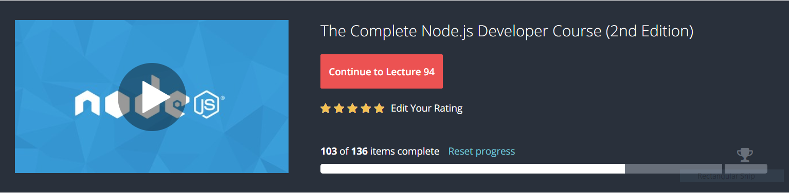

# Welcome to NODEJS Tutorial Udemy for API and Database

## To start the node , type here in your console
```bash
npm install
node server/server.js
```

Link to Udemy studied is : <br>

[Udemy Study](https://www.udemy.com/the-complete-nodejs-developer-course-2/learn/v4/content)